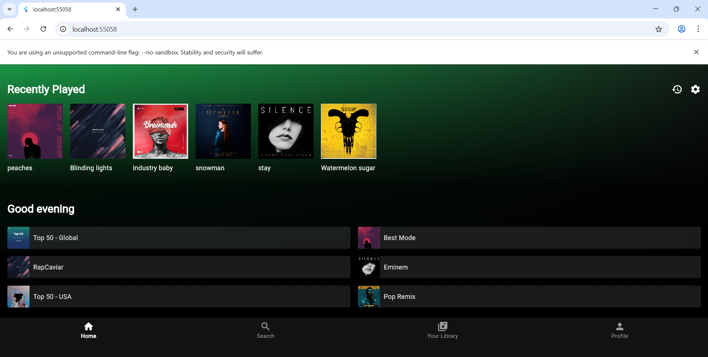
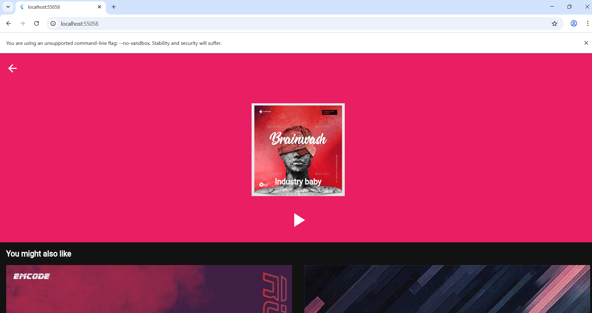
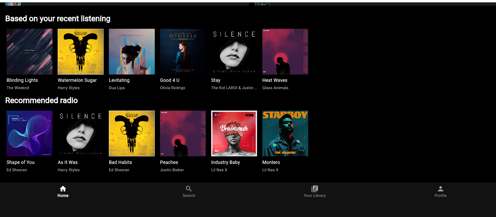

# 🎵 Spotify UI Clone - Flutter

## 📌 Project Overview
A Spotify UI Clone built using Flutter to replicate the modern music streaming interface with responsive layout and clean design.

## 🚀 Features
- Modern Spotify-like UI
- Custom reusable widgets
- Bottom navigation bar
- Music player layout screen
- Responsive design

## 🛠 Tech Stack
- Flutter
- Dart

## 📷 Screenshots

### Home Screen

### Player Screen

### Library Screen

